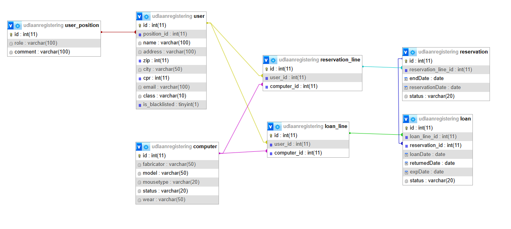

# Udlånsregistrering System (Laptop Loan Registration)

A comprehensive system for tracking and managing laptop loans for educational institutions, built with Vue.js and MySQL.


## 📋 Table of Contents
- [Overview](#overview)
- [Features](#features)
- [Database Schema](#database-schema)
- [Technology Stack](#technology-stack)
- [Getting Started](#getting-started)
  - [Prerequisites](#prerequisites)
  - [Installation](#installation)
- [Usage](#usage)
- [Project Structure](#project-structure)
- [Future Enhancements](#future-enhancements)
- [Contributing](#contributing)
- [License](#license)

## 📝 Overview

This system is designed to manage the loaning of school laptops and peripherals. It enables administrators to register laptops, mice, and users, track loans, manage returns, and monitor equipment availability.

## ✨ Features

- **Equipment Management**
  - Register laptops with brand, model, and ID
  - Track mouse types (optical, standard, none)
  - Monitor equipment status and availability

- **User Management**
  - Register students with detailed information
  - Track user history and loan patterns
  - Manage user positions and roles
  - Flag users with late returns ("blacklisting")

- **Loan Management**
  - Register new loans with expiry dates
  - Track current loans and return dates
  - Identify overdue borrowers
  - Send reminder emails to overdue borrowers
  - View loan history and statistics

- **Reservation System**
  - Allow teachers to reserve laptops
  - Manage reservation schedules

## 🗄️ Database Schema

The system uses a relational database with the following key tables:

- **user**: Stores user information (name, address, email, etc.)
- **user_position**: Manages user roles and positions
- **computer**: Tracks laptop details (fabricator, model, status)
- **reservation**: Manages equipment reservations
- **reservation_line**: Links reservations to specific items
- **loan**: Records active loans
- **loan_line**: Links loans to specific items



## 🛠️ Technology Stack

- **Frontend**:
  - Vue.js
  - Vue Router
  - JavaScript/ES6+
  - HTML5/CSS3

- **Backend**:
  - PHP
  - MySQL
  - XAMPP (Apache, MySQL, PHP)

## 🚀 Getting Started

### Prerequisites

- Node.js and npm
- XAMPP (or similar local server environment)
- MySQL
- Modern web browser

### Installation

1. Clone the repository:
```bash
git clone https://github.com/w1setown/udlaanregistering-prototype.git
cd udlaanregistering-prototype
```

2. Install dependencies:
```bash
npm install
```

3. Set up the database:
   - Start XAMPP and ensure MySQL is running
   - Import the database schema from `backend/sql/database_schema.sql`

4. Configure backend connection:
   - Update database connection details in `backend/dbconn.php`

5. Start the development server:
```bash
npm run serve
```

6. Access the application at `http://localhost:8080`

## 💻 Usage

### Equipment Registration
1. Navigate to the Equipment section
2. Click "Add New Equipment"
3. Enter laptop details (brand, model, ID)
4. Select mouse type
5. Save the equipment record

### User Registration
1. Navigate to the Users section
2. Click "Add New User"
3. Enter student details (ID, name, address, etc.)
4. Assign user position/role
5. Save the user record

### Loan Registration
1. Navigate to the Loans section
2. Select a user
3. Choose available equipment
4. Set loan and expiry dates
5. Confirm the loan

### Managing Returns
1. Navigate to the Active Loans section
2. Find the loan to be returned
3. Click "Return" and confirm
4. The system will update equipment availability

## 📁 Project Structure

```
udlaanregistering-prototype/
├── .github/
│   └── workflows/        # GitHub Actions workflows
├── backend/              # Backend PHP files
│   ├── cors.php          # CORS configuration
│   ├── dbconn.php        # Database connection
│   └── sql/              # SQL scripts
│       └── database_export/  # Database exports
│       └── tables.sql    # Database schema
├── public/               # Public assets
│   ├── favicon.ico       # Site favicon
│   └── index.html        # HTML entry point
├── src/                  # Vue.js source files
│   ├── assets/           # Static assets
│   ├── components/       # Vue components
│   │   ├── AppHeader.vue # Header component
│   │   ├── AppHome.vue   # Home page component
│   │   └── App.vue       # Root component
│   ├── main.js           # Application entry point
│   └── router.js         # Vue Router configuration
├── .gitignore            # Git ignore file
├── babel.config.js       # Babel configuration
├── jsconfig.json         # JavaScript configuration
├── package-lock.json     # Package lock file
├── package.json          # NPM dependencies
└── README.md             # Project documentation
```

## 🔮 Future Enhancements

- **Teacher Registration**: Expanded user management for teachers
- **Advanced Reservation System**: Enhanced reservation capabilities
- **Graphical Loan Statistics**: Visual representations of loan data
- **User Blacklisting**: Flagging system for users with poor return histories
- **Mobile App**: Companion mobile application for easy access
- **Barcode/QR Code Integration**: Streamlined equipment check-in/out

## 🤝 Contributing

Contributions are welcome! Please feel free to submit a Pull Request.

1. Fork the repository
2. Create your feature branch (`git checkout -b feature/amazing-feature`)
3. Commit your changes (`git commit -m 'Add some amazing feature'`)
4. Push to the branch (`git push origin feature/amazing-feature`)
5. Open a Pull Request

Please read [CONTRIBUTING.md](CONTRIBUTING.md) for details on our code of conduct and the process for submitting pull requests.

## 📄 License

This project is licensed under the Creative Commons Attribution-NonCommercial 4.0 International License (CC BY-NC 4.0) - see the [LICENSE](LICENSE) file for details.

This means you are free to:
- Share and distribute the material
- Adapt and build upon the material

Under these conditions:
- You must provide appropriate attribution
- You may not use the material for commercial purposes

---

[](https://vuejs.org/)
[](https://www.mysql.com/)
[](https://creativecommons.org/licenses/by-nc/4.0/)

